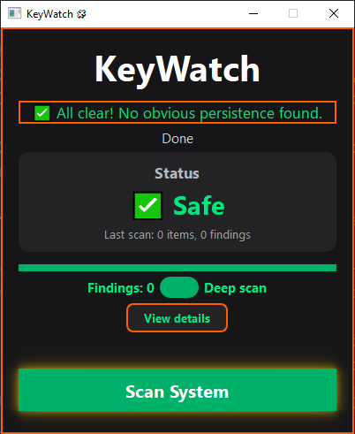
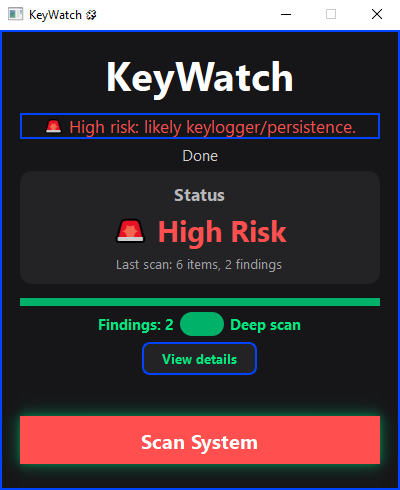

# KeyWatch

A minimal, aesthetic Windows app (PySide6) that **heuristically** flags keylogger-style persistence.

It checks common persistence points and gives you a simple, visual “is anything sketchy here?” answer.
Not an antivirus-just a fast, UI-first sanity check.




---

## ✨ What it checks

- Registry **Run** keys (HKCU/HKLM)
- **Startup** folders (user + common)
- **Scheduled Tasks** (lightweight CSV query)
- **Services** (autostart)
- **Processes** (name/cmdline hints; optional network activity hint)
- Recent executables/scripts in **AppData** (bounded sweep)

The UI runs the scanner on a worker thread (so it stays responsive) and shows a details table of findings.

---

## 🚀 Run (Windows)

```powershell
# 1) Create & activate a virtual environment
python -m venv venv
.\venv\Scripts\Activate.ps1   # if blocked: Set-ExecutionPolicy -Scope Process Bypass

# 2) Install deps
pip install -r requirements.txt

# 3) Launch
python app.py
